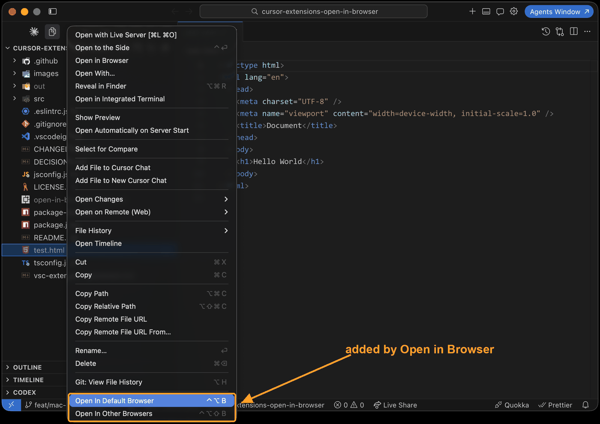

# Open in Browser (Cursor)

Open the current file in your default browser or in any other installed browser.

A maintained fork of [techer.open-in-browser](https://github.com/SudoKillMe/vscode-extensions-open-in-browser) (last released in 2018), adapted for Cursor.

## What's different from the original

* works with current Cursor / VS Code: `engines` bumped to `^1.75.0`, dead `vscode` npm module replaced with `@types/vscode`
* runs in restricted (untrusted) workspaces - the original was silently disabled there
* declared as a `ui` extension, so it opens the browser on your local machine when you work over Remote SSH
* the unmaintained `opn` dependency replaced with `open@8`; Edge is now offered on Mac and Linux too
* tells you what went wrong instead of failing silently: unsaved file, unknown browser name in the settings, browser not installed
* context menu items can be shown for every file type, not only html (`open-in-browser.showForAllFiles`)
* the published package is ~37 KB instead of ~10 MB (the original shipped its dev dependencies)

## How it works

* on *win32* uses `start`
* on *darwin* uses `open`
* otherwise uses the `xdg-open` script from [freedesktop.org](https://portland.freedesktop.org/doc/xdg-open.html)

## Install

Search for `Open in Browser` in the Extensions panel of Cursor and pick the one published by `cloudo`, or install it by id:

```bash
cursor --install-extension cloudo.open-in-browser
```

To build and install from source instead:

```bash
npm install && npm run install-cursor
```

That builds `open-in-browser-<version>.vsix` and installs it into Cursor. Reload Cursor afterwards.

## Usage

|command|Windows, Linux|Mac|
|------|------|------|
|open in default browser|`Alt + B`|`Ctrl + Alt + B`|
|open in specified browser|`Shift + Alt + B`|`Shift + Ctrl + Alt + B`|

Mac gets its own bindings because `Option + B` types a character and `Cmd + Option + B` already toggles the secondary side bar.

Both commands are also available in the command palette (`Open in Browser: ...`) and in the context menu of the editor, the editor tab and the explorer.



`Open In Other Browsers` shows the list of browsers available on your platform, `Open In Default Browser` uses the system default browser unless you configured another one.

## Settings

|setting|default|description|
|------|------|------|
|`open-in-browser.default`|`""`|browser used by `Alt + B`, empty means the system default|
|`open-in-browser.showForAllFiles`|`false`|show the context menu items for every file, not only for html|

`open-in-browser.default` does not need an exact value, any of these works:

__*Chrome*__: *chrome*, *google chrome*, *google-chrome*, *gc*
__*Firefox*__: *firefox*, *mozilla firefox*, *ff*
__*Edge*__: *edge*, *msedge*, *microsoftedge*
__*Safari*__: *safari*
__*Opera*__: *opera*
__*Chromium*__: *chromium*
__*Firefox Developer Edition*__: *firefox developer*, *fde*, *firefox developer edition*
__*IE*__: *ie*, *iexplore*

## Development

```bash
npm run watch
```

Press `F5` in Cursor to start an extension host with the extension loaded.

`master` is protected: every change goes through a pull request, direct pushes and force pushes are rejected.

## Releasing

Bump `version` in `package.json` and add a `CHANGELOG.md` entry in the same pull request. Merging it into `master` is the release: the publish workflow packages the vsix, pushes it to Open VSX and attaches it to a GitHub release. Cursor serves third party extensions from Open VSX through its own proxy, so a new version shows up there once both have indexed it.

## Changelog

see [changelog](CHANGELOG.md)

## License

[MIT](LICENSE.txt)
